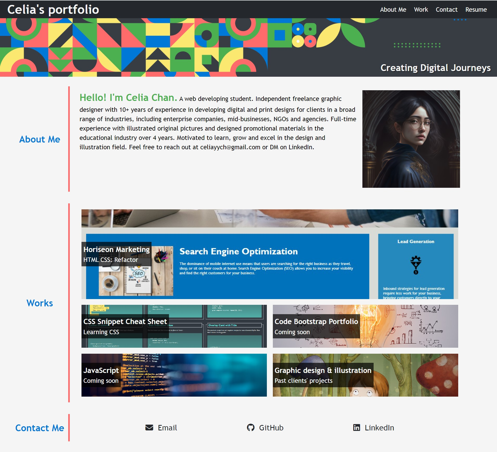
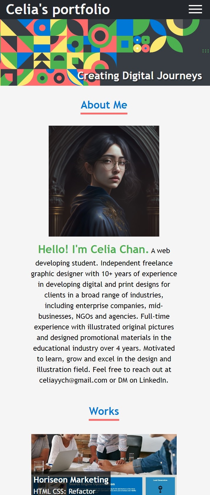

# LSTART (Celia's Portfoilo Website)

## Description

The project is built mainly using a combination of HTML and CSS, with additional frameworks FontAwesome for icons. It provides visitors know more about my background, skills, works and experiences.

## Folder Structure

- **index.html**: The Main HTML file for my portfolio.
- **asset:** includes 2 subfolders for styles (css) & images
  - **css:** css file for styling
  - **img:** images files for website
- **README.md:** This file.
- **LSTART-Screenshot1.jpg:** Screenshot for the HTML file.
- **LSTART-Screenshot2.jpg:** Mobile version screenshot for the HTML file.

## Links

[Visit my application](https://celia103.github.io/LSTART/)

[Visit the GitHub repository](https://github.com/celia103/LSTART)

Application Screenshot:

Application Screenshot (Mobile):

## License

MIT License
